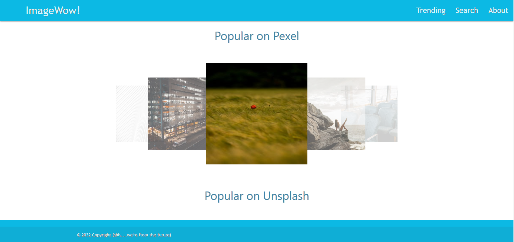
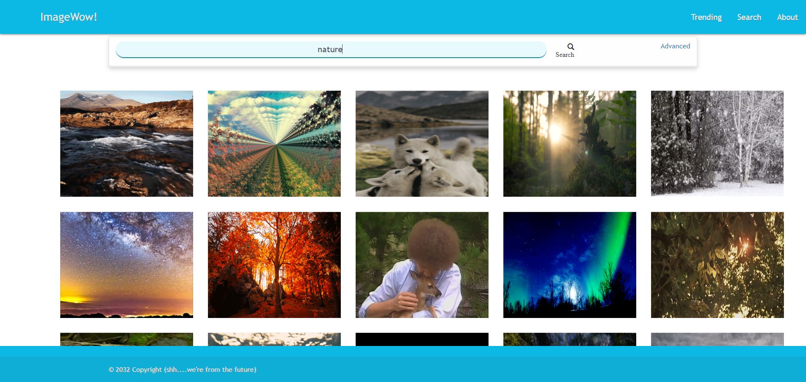
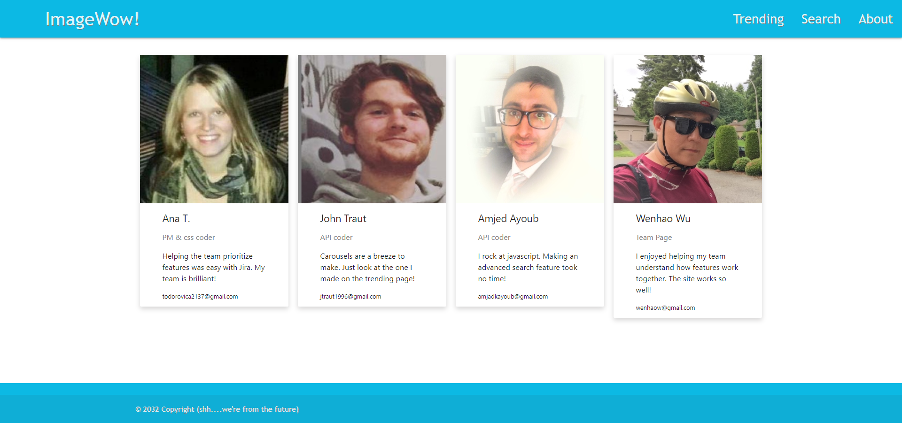

# ImageAggregator

## Overview

Value add of ImageWow!:

CC0 or Creative Commons Zero means that the owner relinquished all copyrights to their work.

Why is this important? 

CC0 is the safest license type to use commercially.
Our site aggregates CC0 photos and gifs from 3 APIs so its users don't have to spend time searching multiple sites for images they can use commercially.


## Getting Started
These instructions will get you a copy of the project on your local machine.

### Installing
Git clone the repository to your local machine:

HTTPS:
```
https://github.com/AmjedAyoub/ImageAggregator.git
```
SSH:
```
git@github.com:AmjedAyoub/ImageAggregator.git
```

## Features

### Trending Page: 

Carousels that display the most popular images from Pexels, Giphy and Upsplash. Click on left or right to move from image to image. 
Once an image catches your eye feel free to click on it, this will lead you to a display that you can go to the direct link, 
or copy that link to the clipboard.



### Search Page:

A basic search that uses keywords to search for images on the 3 APIs and pull them to the search page. Move through the images and observe the tile flip effect. 
On the back you will see the website it was pulled from, and various information about the image itself. 

The advanced search allows a user to narrow down their search criteria by size, file type, site and photographer.

Once an image has been found, feel free to click on it to see a bigger version of an image and if you wish to go to the direct link, 
click on the link button.



### About Page:

Check out the team! Feel free to check out how responsive the page is.  



## Technologies & Tools
* HTML  
* CSS
* JavaScript
* Materialize
* Bootstrap

## Links
This application is deployed on GitHub Pages, [Try it yourself](https://wenhaowu27.github.io/ImageAggregator/).\
This application is published on [GitHub](https://github.com/AmjedAyoub/ImageAggregator).

## Authors
See contribution history [here](https://github.com/AmjedAyoub/ImageAggregator/graphs/contributors).

## Future updates
At the moment, this app is the minimum viable product. For future updates; improve the UI/UX, and add more functionality and features.